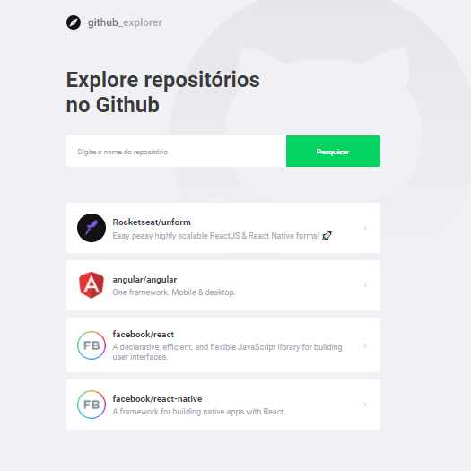

# Github Explorer

<h1 align="center">
    
</h1>

## 💻 Projeto

Github Explorer é uma aplicação desenvolvida durante a bootcamp GoStack, da Rocketseat.

A aplicação consiste em consumir uma API pública do Github que disponibiliza dados dos usuários, repositórios, issues etc. O usuário da aplicação digita o nome do autor e do repositório (autor/repo) para pesquisar o repositório correspondente, que será apresentado em uma listagem abaixo. Essa lista de repositórios pesquisados são armazenadas na local storage. Ao clicar em um dos repositórios listados, o usuário é redirecionado para uma página contendo mais informações sobre o repositório.

### ⚙️ Tecnologias

As tecnologias utilizadas neste projeto foram:

- ReactJS
- TypeScript

### 🚀 Conhecimentos obtidos neste projeto
- Padronização de projetos React utilizando Eslint, Prettier e Editor Config
- Estrutura de pastas
- Estilização utilizando styled-components
- Rotas
- Consumo de API externa utilizando axios
- Armazenamento em local storage

### 🎨 Layout

O layout da aplicação está disponível no Figma:

### 🤔 Como contribuir

- Faça um fork desse repositório;
- Crie uma branch com as suas alterações: `git checkout -b my-feature`;
- Commit suas alterações: `git commit -m 'feat: my new feature'`;
- Faça um push para a sua branch: `git push origin my-feature`.

### 📜 Licença

> Este projeto está sob a licença MIT. Veja o arquivo [LICENSE](https://github.com/jessicafpx/gostack-github-explorer/blob/master/LICENSE.md) para mais detalhes.

---

##### 
 <strong> < desenvolvido por <a href="github.com/jessicafpx"> @jessicafpx</a> /> </strong> 👋
