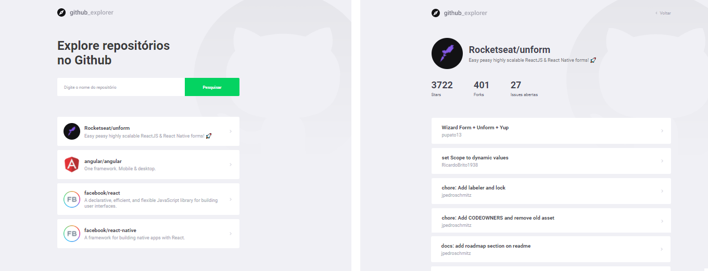

# Github Explorer

<h1 align="center">
    
</h1>

## 💻 Projeto

Github Explorer é uma aplicação desenvolvida durante a bootcamp GoStack, da Rocketseat.

A aplicação consistem em consumir uma API pública do Github que disponibiliza dados dos usuários, repositórios, issues etc. O usuário da aplicação digita o nome do autor e do repositório (autor/repo) para pesquisar o repositório correspondente, que será apresentado em uma listagem abaixo. Essa lista de repositórios pesquisados são armazenadas na local storage. Ao clicar em um dos repositórios listados, o usuário é redirecionado para uma página contendo mais informações sobre o repositório.

### ⚙️ Tecnologias

As tecnologias utilizadas neste projeto foram:

- ReactJS
- TypeScript

### 🚀 Conhecimentos obtidos neste projeto
- Padronização de projetos React utilizando Eslint, Prettier e Editor Config
- Estrutura de pastas
- Estilização utilizando styled-components
- Rotas
- Consumo de API externa utilizando axios
- Armazenamento em local storage

### 🎨 Layout

O layout da aplicação está disponível no Figma:

